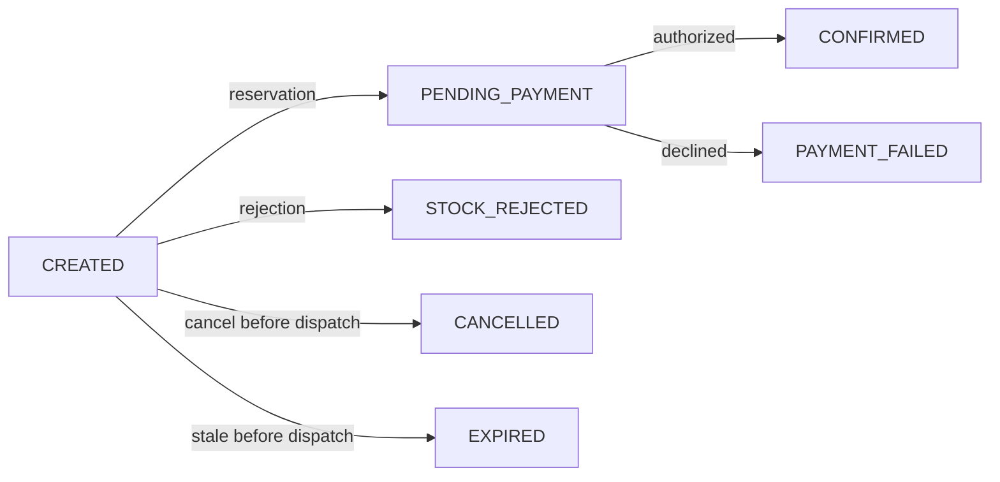

# 003 — Order operations before dispatch and durable query history

Status: accepted

## Context and decision

Inventory consumes `order.created` and its reservation starts payment directly. A local
`CREATED` order therefore does not prove that stock or money is untouched. An unpublished
outbox row also does not prove this: a send can succeed before its transaction rolls back.

Allow customer cancellation only while the checkout event has **never begun dispatch**.
The publisher commits a durable dispatch fence before any broker send. Cancellation locks
the order and its checkout outbox row, removes that row only when unfenced, and atomically
commits the terminal state, history and `order.cancelled` fact. A fenced event is permanently
ineligible, including after timeout or restart. This deliberately small cancellation window
requires neither an inventory release nor payment reversal. Unpublished legacy outbox rows are
all fenced during upgrade because their publication history is unknowable. Because a fence is
irrevocable, each publishing instance keeps at most one batch of fenced, unacknowledged records: during a
broker outage later checkouts stay unfenced and therefore cancellable and expirable.

The same rule permits expiry of never-dispatched orders after 30 minutes (configurable).
This is a dispatch-staleness threshold, not a reservation or payment deadline. A bounded worker
uses database row claims; concurrent workers, publication and cancellation serialize in the
database. Already dispatched `CREATED` orders remain pending a reservation decision and require
operational diagnosis/replay. `PENDING_PAYMENT` and uncertain payments never expire or release
stock. Broader cancellation and reservation reconciliation are deferred to payment operations.

## Transition table

| Trigger / actor | Source | Destination | Fact | Stock / payment | HTTP |
|---|---|---|---|---|---|
| Customer checkout, synchronous | none | CREATED | order.created v1 | No local stock or payment action | 201; semantic replay 200 |
| Inventory reservation, asynchronous | CREATED | PENDING_PAYMENT | existing inventory.reserved v1 | Inventory holds stock; payment may begin | Detail eventually reflects state |
| Inventory rejection, asynchronous | CREATED | STOCK_REJECTED | order.rejected v1 | No stock held; no payment | Detail eventually reflects state |
| Payment authorization, asynchronous | PENDING_PAYMENT | CONFIRMED | order.confirmed v1 | Existing inventory settlement consumes hold | Detail eventually reflects state |
| Payment decline, asynchronous | PENDING_PAYMENT | PAYMENT_FAILED | order.rejected v1 | Existing inventory settlement releases hold | Detail eventually reflects state |
| Customer cancel, synchronous, never dispatched | CREATED | CANCELLED | order.cancelled v1 | Checkout dispatch suppressed; no stock or payment exists | 200 |
| Staleness worker, never dispatched | CREATED | EXPIRED | order.expired v1 | Checkout dispatch suppressed; no stock or payment exists | Detail eventually reflects state |
| Customer cancel replay | CANCELLED | CANCELLED | none | No effect | 200 |
| Customer cancel after dispatch or other state | any other | unchanged | none | No effect | 409 ORDER_NOT_CANCELLABLE |

Every mutation and its public history/outbox commit in one transaction. Inbox deduplication
and order row locks serialize deliveries. Early payment evidence remains durable until its
reservation arrives; both public transitions are then recorded. First terminal outcome wins;
duplicate and late events cannot reopen terminal orders or duplicate history. Conflicting
nonterminal causal evidence rolls back and follows existing retry/DLT handling.

Cancellation has no client payload or lost-update risk: eligibility is checked under the same
locks as the mutation. No `If-Match` or extra idempotency key is required. Concurrent retries
return the same terminal resource; unrelated lifecycle outcomes produce deterministic conflicts.

## Query and privacy boundary

Separate `/api/v1/orders` customer and `/api/v1/merchant/orders` merchant collections make
authorization explicit. Customer queries always scope tenant plus signed subject; merchant
queries scope tenant and require MERCHANT_ADMIN or MERCHANT_USER. Detail and history use the same scope and hidden
404 semantics. Representations contain no subject, identity metadata, provider reference or
transport internals. History is order-owned persisted business data, not an outbox projection.

Collections use descending immutable `(createdAt, id)` keysets, default 20 and maximum 100,
with optional exact status and inclusive lower/exclusive upper creation timestamps. Cursors
are opaque, versioned and validated. Newer insertions cannot shift the next page; status filters
are live views, not snapshot isolation across HTTP requests. Indexes cover the actual tenant,
owner, status and ordering predicates.

## Persistence and rollout

Each of the five stateful services owns Flyway migrations. V1 preserves the v0.1.0 schema;
subsequent migrations are append-only. Fresh databases migrate on startup. Existing databases
require an explicit operator-approved baseline at version 1 after schema verification and a
backup; automatic baseline-on-migrate is disabled. The upgrade procedure must stop all old
publishers before new lifecycle operations are available. Mixed old/new publisher rollout is
unsupported because old publishers do not persist dispatch fences.

Historical v0.1.0 transitions cannot be invented. Migration records a clearly labelled current
state snapshot for existing orders; its timestamp is the migration observation time. New orders
have complete histories. Upgrade tests preserve old orders, idempotency keys and transport data.

The extra short transaction before sending deliberately trades throughput for a durable proof
that a checkout has never escaped. Fences and lifecycle history have no automatic retention;
future cleanup must preserve cancellation evidence and public history.
